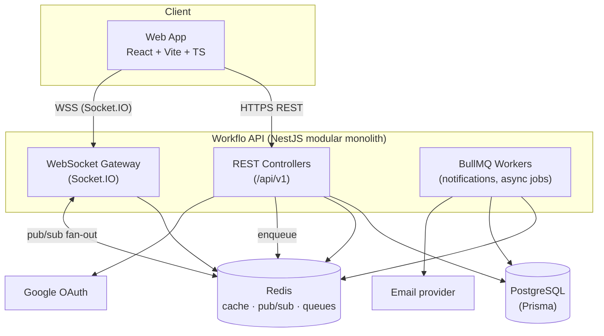
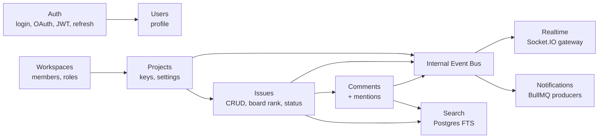
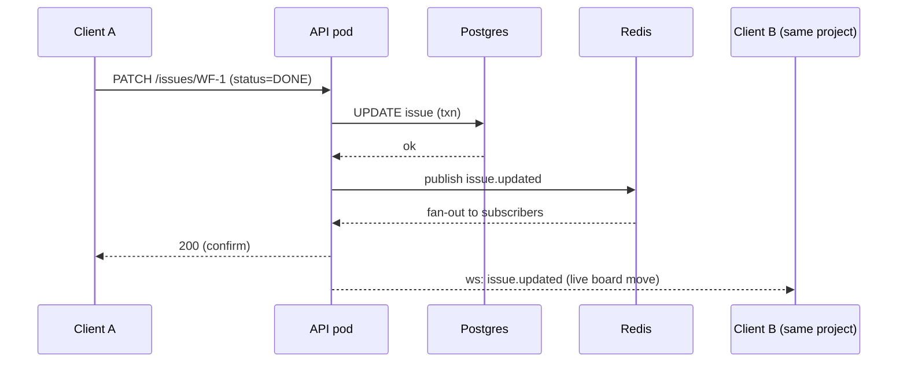

# Workflo — System Architecture

Status: **Draft v1** · Owner: core team · Last updated: 2026-07-01

This document is the technical companion to [CLAUDE.md](../CLAUDE.md). It covers requirements, the C4 view, data model, API surface, the real-time layer, and cross-cutting concerns. Key decisions are recorded as ADRs in [adr/](adr/).

---

## 1. Requirements

### 1.1 Functional (MVP)
- Auth (email/password + Google OAuth), single workspace role (owner/member).
- CRUD: Workspace → Project → Issue; issue types Task/Bug + lightweight Epic grouping.
- Kanban board with drag & drop (status + rank), backlog/list view with filters.
- Issue detail: comments + `@mentions`.
- Real-time board/issue/comment updates + presence.
- Fast search over title/description/assignee (no JQL).

### 1.2 Non-functional
| NFR | Target | Approach |
|-----|--------|----------|
| Latency (perceived) | UI actions feel instant (< 100 ms optimistic) | Optimistic UI + TanStack Query cache; server round-trip async. |
| Real-time | Board/issue changes propagate < 500 ms | Socket.IO + Redis pub/sub. |
| Consistency | Strong for issue mutations | Postgres transactions; single source of truth. |
| Scalability | Handle small teams now, scale horizontally later | Stateless API pods + Redis adapter; modular monolith → extractable modules. |
| Type safety | No FE/BE contract drift | Shared Zod schemas in `packages/shared`. |
| Security | Standard web app hardening | JWT + refresh, RBAC guard, input validation, rate limiting. |
| Observability | Trace failures fast | Structured logs (pino), request IDs, health checks. |

### 1.3 Constraints
- Frontend is React (user-fixed). One language (TypeScript) across the stack.
- Small team / early stage → optimize for dev velocity and low ops overhead. No premature microservices.

---

## 2. Architecture Overview (C4)

### 2.1 Context (C1)
Users (team members) interact with the **Workflo Web App** in the browser. The web app talks to the **Workflo API**, which persists to **PostgreSQL**, uses **Redis** for cache/pubsub/queues, and calls **Google OAuth** for social login and an **email provider** for transactional mail.

### 2.2 Container diagram (C2)



### 2.3 Component diagram (C3) — API modules

The API is a **modular monolith**. Each domain module owns its controllers, services, Prisma access, and DTOs. Modules communicate via an internal event bus (NestJS `EventEmitter`), which also drives real-time fan-out and queue jobs.



Why modular monolith and not microservices: **ADR-0001**.

---

## 3. Data Model

Core relational schema (Prisma-style sketch — the real schema lives in `apps/api/prisma/schema.prisma`, written during implementation):

```prisma
model User {
  id          String   @id @default(cuid())
  email       String   @unique
  name        String
  avatarUrl   String?
  passwordHash String?             // null when OAuth-only
  createdAt   DateTime @default(now())
  memberships WorkspaceMember[]
  assigned    Issue[]  @relation("assignee")
  reported    Issue[]  @relation("reporter")
  comments    Comment[]
}

model Workspace {
  id        String   @id @default(cuid())
  name      String
  slug      String   @unique
  createdAt DateTime @default(now())
  members   WorkspaceMember[]
  projects  Project[]
}

enum Role { OWNER MEMBER }

model WorkspaceMember {
  id          String    @id @default(cuid())
  workspace   Workspace @relation(fields: [workspaceId], references: [id])
  workspaceId String
  user        User      @relation(fields: [userId], references: [id])
  userId      String
  role        Role      @default(MEMBER)
  @@unique([workspaceId, userId])
}

model Project {
  id          String    @id @default(cuid())
  workspace   Workspace @relation(fields: [workspaceId], references: [id])
  workspaceId String
  key         String    // e.g. "WF" -> issues WF-123
  name        String
  createdAt   DateTime  @default(now())
  issues      Issue[]
  labels      Label[]
  counter     Int       @default(0) // monotonic per-project issue number
  @@unique([workspaceId, key])
}

enum IssueType { TASK BUG EPIC }
enum IssueStatus { TODO IN_PROGRESS DONE }
enum Priority { LOW MEDIUM HIGH URGENT }

model Issue {
  id          String      @id @default(cuid())
  project     Project     @relation(fields: [projectId], references: [id])
  projectId   String
  number      Int         // human key = project.key + "-" + number
  title       String
  description String?     // rich text (JSON) later; markdown for MVP
  type        IssueType   @default(TASK)
  status      IssueStatus @default(TODO)
  priority    Priority    @default(MEDIUM)
  assignee    User?       @relation("assignee", fields: [assigneeId], references: [id])
  assigneeId  String?
  reporter    User        @relation("reporter", fields: [reporterId], references: [id])
  reporterId  String
  parent      Issue?      @relation("epic", fields: [parentId], references: [id]) // Epic grouping
  parentId    String?
  children    Issue[]     @relation("epic")
  labels      Label[]     @relation("IssueLabels")
  rank        String      // LexoRank-style string for board ordering
  dueDate     DateTime?
  createdAt   DateTime    @default(now())
  updatedAt   DateTime    @updatedAt
  comments    Comment[]
  searchVector Unsupported("tsvector")?  // Postgres FTS
  @@unique([projectId, number])
  @@index([projectId, status, rank])
}

model Label {
  id        String  @id @default(cuid())
  project   Project @relation(fields: [projectId], references: [id])
  projectId String
  name      String
  color     String
  issues    Issue[] @relation("IssueLabels")
  @@unique([projectId, name])
}

model Comment {
  id        String   @id @default(cuid())
  issue     Issue    @relation(fields: [issueId], references: [id])
  issueId   String
  author    User     @relation(fields: [authorId], references: [id])
  authorId  String
  body      String
  mentions  String[] // userIds mentioned -> drives notifications
  createdAt DateTime @default(now())
  updatedAt DateTime @updatedAt
}

model Notification {
  id        String   @id @default(cuid())
  userId    String
  type      String   // MENTION, ASSIGNED, STATUS_CHANGE...
  payload   Json
  readAt    DateTime?
  createdAt DateTime @default(now())
  @@index([userId, readAt])
}
```

**Board ordering:** issues carry a `rank` string (LexoRank-style) so drag & drop reordering is an O(1) update of one row — no reindexing the whole column.

**Human keys:** `Project.counter` gives each issue a monotonic `number`; the display key is `WF-123`. Allocation happens inside the create transaction to avoid gaps/races.

---

## 4. API Surface

REST under `/api/v1`, versioned. DTOs validated with Zod schemas imported from `packages/shared` (same schemas the frontend uses). See **ADR-0004** (shared types) and **ADR-0005** (auth).

Representative endpoints (MVP):

```
POST   /api/v1/auth/register
POST   /api/v1/auth/login
POST   /api/v1/auth/refresh
GET    /api/v1/auth/google            # OAuth start
GET    /api/v1/auth/google/callback

GET    /api/v1/workspaces
POST   /api/v1/workspaces
GET    /api/v1/workspaces/:id/members
POST   /api/v1/workspaces/:id/members

GET    /api/v1/projects?workspaceId
POST   /api/v1/projects

GET    /api/v1/projects/:id/issues?status&assignee&label&q   # board + backlog + search
POST   /api/v1/projects/:id/issues
GET    /api/v1/issues/:key                                    # WF-123
PATCH  /api/v1/issues/:key                                    # partial update (status, rank, fields)
DELETE /api/v1/issues/:key

GET    /api/v1/issues/:key/comments
POST   /api/v1/issues/:key/comments

GET    /api/v1/search?q&workspaceId
GET    /api/v1/notifications
POST   /api/v1/notifications/:id/read
```

Conventions: cursor pagination (`?cursor=&limit=`), consistent error envelope `{ error: { code, message, details } }`, idempotent PATCH, rate limiting on auth routes.

---

## 5. Real-time Layer

- **Transport:** Socket.IO gateway in NestJS, authenticated with the same JWT (handshake auth token).
- **Rooms:** clients join `project:{id}` and `issue:{key}` rooms; presence tracked per room.
- **Scale-out:** Socket.IO **Redis adapter** so events fan out across all API pods.
- **Event flow:** a mutation (e.g. `PATCH /issues/WF-1`) commits in Postgres → emits a domain event on the internal bus → Realtime module broadcasts to the room, and Notifications module enqueues a BullMQ job.



Core events: `issue.created`, `issue.updated`, `issue.moved`, `issue.deleted`, `comment.added`, `presence.update`.

---

## 6. Frontend Architecture

- **Vite + React + TS** SPA.
- **Server state:** TanStack Query (caching, optimistic updates, request dedup).
- **Client/UI state:** Zustand (board drag state, command palette, modals).
- **Real-time:** a single Socket.IO client; incoming events patch the TanStack Query cache directly (no full refetch).
- **Keyboard-first:** global command palette (⌘K) and shortcuts as a first-class layer — a core differentiator vs Jira.
- **Types:** imports request/response types + Zod schemas from `packages/shared`.

---

## 7. Cross-cutting Concerns

| Concern | Approach |
|---------|----------|
| **AuthN** | JWT access (short-lived) + refresh (httpOnly cookie). Google OAuth via Passport. |
| **AuthZ** | NestJS guards; workspace membership + role checked per request. |
| **Validation** | Zod schemas (shared) at the controller boundary. |
| **Errors** | Global exception filter → consistent JSON envelope. |
| **Logging** | pino structured logs + request IDs; correlate WS + HTTP. |
| **Config/secrets** | `@nestjs/config` + env validation at boot (fail fast). |
| **Migrations** | Prisma Migrate. |
| **Testing** | Unit (services) + integration (supertest + test DB) + minimal E2E. Written on **Sonnet 5**. |
| **CI/CD** | GitHub Actions: lint → typecheck → test → build. (Set up later.) |

---

## 8. Repository Layout (target)

```
Workflo/
├── CLAUDE.md
├── docs/
│   ├── architecture.md          # this file
│   └── adr/                      # decision records
├── apps/
│   ├── web/                      # React + Vite + TS
│   └── api/                      # NestJS + Prisma
│       └── prisma/schema.prisma
├── packages/
│   └── shared/                   # Zod schemas + TS types (FE/BE contract)
├── pnpm-workspace.yaml
├── turbo.json
└── package.json
```

---

## 9. Risks & Mitigations

| Risk | Impact | Mitigation |
|------|--------|------------|
| Real-time complexity added too early | Slows MVP | Keep event set small (6 events); Redis adapter is a few lines. |
| Board rank races on concurrent drags | Corrupt ordering | LexoRank strings + server-authoritative rank; conflict → re-rank neighbor. |
| Scope creep toward full Jira | Never ships | CLAUDE.md §5 scope lock; park ideas in §7. |
| Postgres FTS insufficient later | Weak search | FTS is fine for MVP; Elastic/Meilisearch is a clean later swap behind the Search module. |
| Monolith becomes a big ball of mud | Hard to scale team | Strict module boundaries + internal event bus so modules stay extractable. |

---

## 10. Decision Records

| ADR | Decision |
|-----|----------|
| [0001](adr/0001-modular-monolith.md) | Modular monolith over microservices |
| [0002](adr/0002-postgres-prisma.md) | PostgreSQL + Prisma as datastore/ORM |
| [0003](adr/0003-realtime-socketio-redis.md) | Socket.IO + Redis adapter for real-time |
| [0004](adr/0004-monorepo-shared-types.md) | pnpm monorepo with shared Zod/types package |
| [0005](adr/0005-auth-jwt-oauth.md) | JWT + refresh + Google OAuth |
| [0006](adr/0006-search-postgres-fts.md) | Postgres full-text search for MVP (no JQL) |
